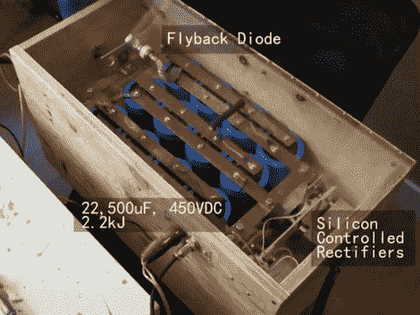

# 测量大型电容器组约 10 千安培的输出

> 原文：<https://hackaday.com/2011/04/21/measuring-the-10-kiloamp-output-of-a-large-capacitor-bank/>

[Norman]组装了一个相当可观的 22，500 uF 电容器组。除了寻找用突然放电产生的强磁场来折磨的东西，他还想测量从设备中推出的电流。他发现了一种使用数字存储示波器的方法。为了保护示波器，[Norman]建造了自己的接口盒，其中包括一个 50 倍的分压器，并与一个名为[的电流传感器和一个罗果夫斯基线圈](http://aonomus.wordpress.com/2011/04/18/digital-oscilloscopes-capacitor-banks-and-loud-bangs-oh-my/)连接。到了进行实验的时候，他转动银行充电器上的安全锁定键，然后拨动开关释放储存的电势。

休息后看看视频，看看汽水罐和硬盘驱动器被设备损坏。示波器测量接近 10 kA 的输出，给[Norman]他开始捕捉的数据。他已经将这个项目加入泰克竞赛，在那里它将与[钢琴调音师](http://hackaday.com/2011/04/17/oscilloscope-piano-tuning-101/)和[激光表演测试员](http://hackaday.com/2011/04/14/analog-scope-stands-in-to-for-laser-light-show/)竞争，仅举几例。

 <https://www.youtube.com/embed/3YG66kqhUh4?version=3&rel=1&showsearch=0&showinfo=1&iv_load_policy=1&fs=1&hl=en-US&autohide=2&wmode=transparent>

 </body> </html>