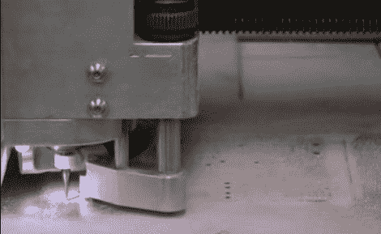

# PCB 铣削教程

> 原文：<https://hackaday.com/2011/04/22/pcb-milling-tutorial/>

[胡安·何塞·钟]将一组视频和[一份加工印刷电路板的 PDF 指南](http://www.depts.ttu.edu/ece/ieee/documents/TTU_Milling_Tutorial_2011.pdf)放在一起。你会发现这一对视频，总共约 22 分钟，在休息后嵌入。在他们的文章中，[Jaun]详细介绍了德州理工大学 IEEE 分会使用的技术来研磨 PCB，而不是使用传统的蚀刻方法。我们长期以来一直是[研磨印刷电路板](http://hackaday.com/2009/12/16/automotive-current-monitor/)的粉丝，并经常梦想有一天我们可以淘汰我们用于墨粉转移方法的旧铁。

在本教程中， [IsoPro](http://www.t-tech.com/products/software.asp) 是用于控制磨机的软件。PCB 设计程序的 CAM 文件被导入–它们可以来自许多不同的程序，包括 EagleCAD。通过几个设置步骤，操作员可以配置铣削正确公差所需的分辨率，然后在软件中计算出描绘每条轨迹的路径。为了方便双面纸板，在覆铜板上钻一个参考孔，以接受轧机工作台上的支柱。用一些箔带粘住基底，设置端铣刀的深度，让机器完成它的工作。[Juan 的]视频展示了制作一个相当复杂的电路板有多快，大约 20 分钟就能完成。

[https://www.youtube.com/embed/36wm02cskiE?version=3&rel=1&showsearch=0&showinfo=1&iv_load_policy=1&fs=1&hl=en-US&autohide=2&wmode=transparent](https://www.youtube.com/embed/36wm02cskiE?version=3&rel=1&showsearch=0&showinfo=1&iv_load_policy=1&fs=1&hl=en-US&autohide=2&wmode=transparent)

[https://www.youtube.com/embed/fZUzuBq9Xr4?version=3&rel=1&showsearch=0&showinfo=1&iv_load_policy=1&fs=1&hl=en-US&autohide=2&wmode=transparent](https://www.youtube.com/embed/fZUzuBq9Xr4?version=3&rel=1&showsearch=0&showinfo=1&iv_load_policy=1&fs=1&hl=en-US&autohide=2&wmode=transparent)