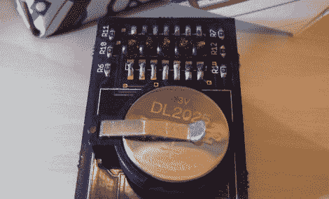

# 迷你 LED 留言板由复古显示器制成

> 原文：<https://hackaday.com/2011/04/24/mini-led-message-board-built-from-retro-displays/>

[伊恩]在他的生活中，他发现自己越来越怀念年轻时的各种不同的技术。他一直喜欢的一个项目是第一代 7 段消费者 LED 显示器，就像在旧计算器中发现的那些。

他很兴奋地在一个装满电子零零碎碎的盒子底部发现了这样一个显示器，这是他从一个朋友那里收到的。在确认了显示器并在网上找到数据表后，[他决定用它来制作某种小玩意](http://www.lushprojects.com/pert/)。

他的第一个想法是从显示屏上制作一个微小的文本滚动装置，这样他的“个人电子复古电报”(P.E.R.T)就诞生了。有了 Arduino 在手，他在试验板上制作了电路原型，然后被送去制造一些印刷电路板。一旦他收到电路板，他所有的原型元件都被替换成 SMD 版本，包括一个 TQFP ATMega168 芯片来代替全尺寸的 Arduino 板。

最后的结果是一个新老技术的完美结合，他决定作为礼物送给他的女朋友。请继续阅读，观看 P.E.R.T .的快速视频。