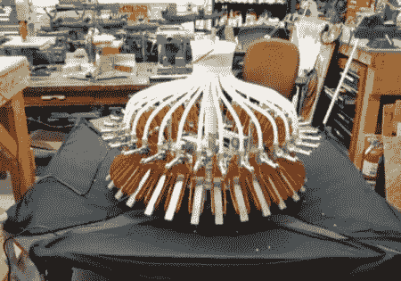

# 振动加速器

> 原文：<https://hackaday.com/2011/04/24/the-vibrotron/>

请看[振动管](http://www.roboticsclub.org/projects/roborchestra/vibratron)！由卡内基梅隆大学机器人俱乐部建造的振动加速器是一个名为 robOrchestra 的更大项目的一部分。这里的操作机制非常简单。你有两个装有小钢珠的容器。一个在底部，一个在顶部。用一个[阿基米德螺旋](http://en.wikipedia.org/wiki/Archimedes_screw)将底部的放入顶部的。一旦到了顶部，它们就通过一些管道向下分配到电颤琴键上。所有的计时都是通过安装在管子末端的螺线管来完成的。最终产品让我们想起了几年前推出的[动画](http://www.youtube.com/watch?v=hyCIpKAIFyo)。

对于这个系统，因为他们希望这是一个自动化和可重新配置的机器人，他们使用 Arduino 来控制螺线管。这样他们就可以随心所欲地换歌了。我们不得不承认，虽然，我们很乐意看到一首歌的时间都是通过管长度或其他一些被动系统，允许它是手摇和纯机械的。

 <https://www.youtube.com/embed/Y66-KiC_Qro?version=3&rel=1&showsearch=0&showinfo=1&iv_load_policy=1&fs=1&hl=en-US&autohide=2&wmode=transparent>

 
[通过<a href="http://blog.makezine.com/archive/2011/04/vibratron-robot-makes-music-using-steel-balls.html" target="_blank">使</a>
 </body> </html>