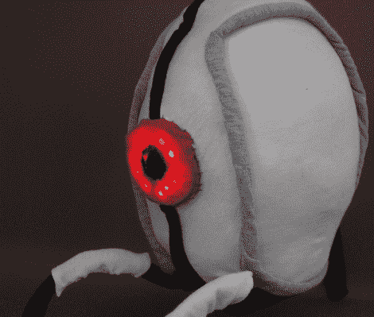

# 传送门炮塔 Plushie 是可爱和无害的

> 原文：<https://hackaday.com/2011/04/25/portal-turret-plushie-is-cute-and-harmless/>

正如你们中的许多人可能知道的，传送门 2 上周发布了，游戏玩家已经为之疯狂。多年来，人们建造了他们最喜欢的游戏物品和“角色”的复制品，包括传送门枪、同伴立方体和炮塔。

在玩了一会传送门 2 之后，[乔纳森] [非常想要一个属于自己的炮塔](http://upnotnorth.net/projects/portal-turret-plushie/)。然而，他没有用硬塑料和树脂来建造它，而是决定建造一个可爱的会说话的炮塔。

在朋友[利·努南]的帮助下，他现在自豪地拥有了一座普鲁西炮塔。它比你想象的要小一点，但是它充满了炮塔个性。plushie 可以播放游戏中的音频，可以感知其面部附近的运动，检测它是否被翻倒，还可以知道它何时被捡起。[乔纳森]增加了所有这些功能，在炮塔里塞了一个 Arduino，还有一个播放声音的防波板。通过三个不同的传感器提供接近和运动感应，使炮塔能够像游戏中的兄弟一样工作(除了机枪)。

这真的是一个整洁的小玩具，一个我们无疑会很高兴拥有的玩具。继续阅读，观看他的 plushie 炮塔在行动中的短片。

[https://player.vimeo.com/video/22804972](https://player.vimeo.com/video/22804972)