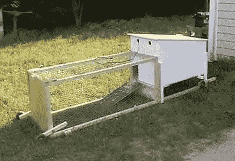

# 给家里打电话的鸡拖拉机

> 原文：<https://hackaday.com/2011/04/26/a-chicken-tractor-to-call-home/>

[迪诺]不想在他工作的时候把小鸡关起来，但他也不想让它们逃跑，或者成为美味佳肴。他的解决方案是[建造这台鸡拖拉机](http://hackaweek.com/hacks/?p=125)。这是一个完整的带轮子的鸡生态系统，有点像我们有羽毛的朋友的双宽拖车。一端是一个小笼子，里面有食物、水和取暖用的白炽灯泡。另一端是一个铁丝网盒子，让小鸟伸展四肢，呼吸新鲜空气。

当[迪诺]需要移动这个装置时，很容易看到轮子向下翻转。就像我们说的，他上班时会把它拿出来，选择院子的不同部分，这样草就能均匀施肥。如果你没有足够的空间来建造自动化鸡舍，这是一个不错的解决方案。

休息之后我们嵌入了(迪诺的)视频。他覆盖了构建的开始和结束，并在视频中间填充了构建过程的延时记录。

 <https://www.youtube.com/embed/QbRTR24PD-Y?version=3&rel=1&showsearch=0&showinfo=1&iv_load_policy=1&fs=1&hl=en-US&autohide=2&wmode=transparent>

 </body> </html>