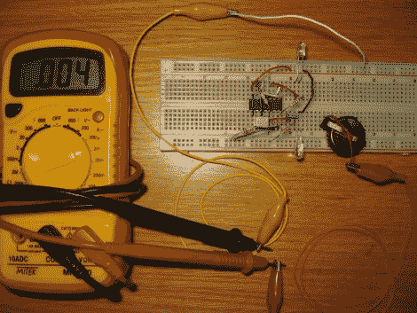

# 延长 LED 多米诺骨牌的电池寿命

> 原文：<https://hackaday.com/2011/04/26/extending-the-battery-life-of-led-dominoes/>

[Fede.tft]写信告诉我们他一直在做的一些工作，以节省 LED 多米诺骨牌的电池寿命。他最初是在看了[这篇关于电子游戏卡](http://hackaday.com/2011/03/01/endless-fun-with-led-dominoes/)的帖子后有了这个想法。该项目旨在 555 定时器竞赛，因此，使用了 555 定时器。[Fede.tft]计算 CR2302 电池在 555 电路中的电池寿命不超过 80 天。如果你从来不使用它们，led 也不会亮。不使用时将电池从设备中取出是有意义的，但重新设计以提高效率绝对值得付出努力。

这种再现抛弃了 555 芯片，而采用了 CMOS 芯片。通过在 CD4011 芯片的四个与非门周围建立一个电路，电池的待机寿命可以增加到大约 4.5 年。还不错！此外，更换 555 定时器并没有增加元件数量，芯片的价格与 555 相似，并且您不需要求助于微控制器。是的，我们喜欢。