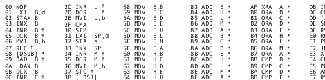

# 黑客一天链接:2011 年 4 月 27 日

> 原文：<https://hackaday.com/2011/04/28/hack-a-day-links-april-27-2011/>

**重新制作第一款视频游戏**

在 2011 年修订版演示展上，一个名为[[MEGA](http://www.m-e-g-a.org)的博物馆项目凭借其零比特再现的“双人网球”赢得了“野生”类的第一名。这款复古游戏完全由模拟电子设备制成，在一个圆形 o-scope 屏幕上完成展示。休息之后你可以看到它的视频。

**崭新的自行车电脑**

[Alex DLP]的最新 instructable 是一款吸引人的紧凑型[自行车电脑](http://www.instructables.com/id/Wireless-Altoids-Cycle-Computer/)运行在 Arduino 上，并具有常见的自行车功能。它还不止于此，增加一个 16×2 的 LCD 为数字形式和条形图形式的数据提供了更多的空间，增加一对无线电调制解调器可以将数据反馈回家，在那里可以记录和比较，非常适合更认真的自行车手。

**8085 参考卡**

**
**

如果你喜欢复古电脑，或者想自己动手制作，你会发现这款[英特尔 8085 参考卡](http://catsonkeyboards.blogspot.com/2011/04/8085-microprocessor-reference-card.html)是一个真正的享受。在原始参考卡的基础上，它被扩展到提供更多的额外中断、电参考、T 状态定时和未记录指令的细节。

**将 SNES 控制器连接到您的安卓手机上**

[Bruno]希望能够在他的 HTC Android 手机上使用带有仿真器的[真正的 SNES 控制器，包装一个 Arduino、6 节 AA 电池和一个试验板，任务完成了！几乎没有手机便携，但我们赞扬“搞定它”的精神。休息之后，请加入我们，观看一段简短的视频。](http://blog.bsoares.com.br/arduino/snes-android-amarino-original-controller-bluesmirf)

**重制第一款电子游戏**

 <https://www.youtube.com/embed/K11UE_SLoRI?version=3&rel=1&showsearch=0&showinfo=1&iv_load_policy=1&fs=1&hl=en-US&autohide=2&wmode=transparent>

 
<strong>将 SNES 控制器连接到您的安卓手机上</strong>
 
<strong>
<iframe src="https://player.vimeo.com/video/22722692" width="800" height="480" frameborder="0" webkitallowfullscreen="" mozallowfullscreen="" allowfullscreen=""/>
</strong>
 </body> </html>