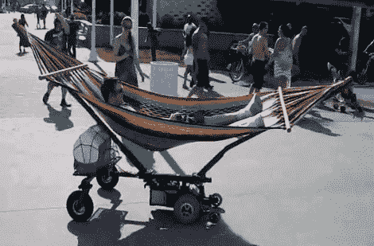

# 懒惰，同时也要有所成就

> 原文：<https://hackaday.com/2011/04/27/be-lazy-and-get-somewhere-at-the-same-time/>

使用这款电动吊床，以舒适的牙买加风格在海滩上巡游。[Stephen Shaffer]和他的朋友为[红牛创作大赛](http://www.redbullusa.com/cs/Satellite/en_US/Creation/001242969629749)建造了它，该大赛的首要要求是需要包括一个 Arduino。我们基本上是在看一个由方管制成的吊床框架，它被装在轮子上。休息后观看视频，了解原型、构造和最终产品。看起来最初用于推进的电动轮椅底座位于吊床下方的中央。一个急转弯，骑手/操作员被甩到水泥地上。

最终版本包括一对车轮，作为支架，保持车辆直立。PlayStation 2 控制器用于转向和方向控制。它由 Arduino 进行投票，然后使用伺服电机来控制原来的轮椅操纵杆。至少这是我们通过观看视频能够弄清楚的。

【维梅奥 http://vimeo.com/22826209 w = 470】