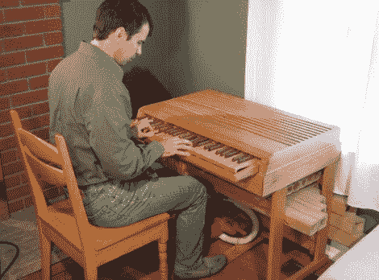

# 如何采访[马蒂亚斯·万德尔]

> 原文：<https://hackaday.com/2011/04/27/wonderhowto-inteview-of-matthias-wandel/>

如果你是一个狂热的 Hackaday 读者，你很可能会立刻认出(马蒂亚斯·万德尔的)名字。他已经被介绍过很多次了，因为他有很多天赋。最值得一提的是，他能用木头做一些神奇的事情。但真的，这是最重要的想法，他似乎有一个行李袋装满了它们。WonderHowTo 网站的[Rachel adn Justin]最近发表了对 Mattias 的采访。在这篇文章中，他分享了他对这些想法从何而来的想法，他如何处理他的项目，甚至分享了一些对那些刚刚起步的人的建议。

这通常是我们发表诙谐评论并尝试链接到过去的专题文章的时候。如果我们只限于一个，那就相当困难了(尽管在我们心中有一个特殊的位置给黄蜂吸盘。幸运的是，我们没有受到限制，所以这里列出了 Hackaday 之前报道的一些[Matthias ' s]项目:

*   [黄蜂吸盘](http://hackaday.com/2010/07/01/wasp-sucker-clears-the-air/)
*   [DIY 光盘复制器](http://hackaday.com/2006/06/17/diy-optical-disc-duplicator/)
*   [球轴承运动场](http://hackaday.com/2011/01/27/58-ball-bearing-playground/)
*   [如何制造带锯](http://hackaday.com/2010/04/09/make-a-bandsaw/)
*   [乐高多米诺摆放器](http://hackaday.com/2010/01/11/lego-robot-lays-dominoes-not-eggs/)
*   [木制键盘套](http://hackaday.com/2009/12/08/creating-wooden-enclosures/)
*   [单针点阵打印机](http://hackaday.com/2007/04/11/one-pin-diy-dot-matrix-printer/)
*   [木制二进制加法器](http://hackaday.com/2009/10/13/binary-adder-will-give-you-slivers/)