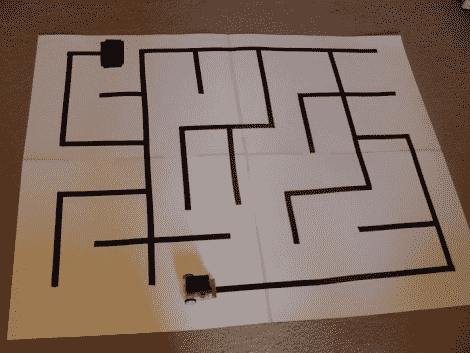

# 机器人迷宫解决背后的概念

> 原文：<https://hackaday.com/2011/04/28/the-concepts-behind-robotic-maze-solving/>

帕特里克·麦凯布的最新产品是一款设计精良的迷宫解决机器人。这种对过去时间的竞争比我们已经看过的的[微型机器人速度迷宫解决方案对你的普通人类来说更容易接近。不要错过在折叠下方的剪辑中观看有条不紊的过程。](http://hackaday.com/2010/10/29/maze-solving-robo-mouse/)

(帕特里克的)机器人正在导航的比赛场地是由白色背景上的电子磁带轨道组成的。两英寸高的双层机器人非常经济。它使用 RBBB Arduino 板读取 Pololu 制造的光学反射传感器阵列，然后使用 L293D h 桥分线板驱动几个齿轮电机。但是我们已经知道【Patrick 的】[是一个天才的机器人建造者](http://hackaday.com/2011/03/28/nano-sumo-robot-takes-on-all-comers/)，这一次我们很高兴看到他对[如何给机器人编程以解决迷宫](http://www.patrickmccabemakes.com/PatrickMccabeMakes/Mazesolving.html)的深入讨论。在书中，他涵盖了你的机器人可能面临的所有不同情况，以及如何应对这些情况。一旦你理解了所有的概念，掸掉你放在角落里的那个机器人的灰尘，开始写一些新的固件。

[https://www.youtube.com/embed/2FF6ceCI0kc?version=3&rel=1&showsearch=0&showinfo=1&iv_load_policy=1&fs=1&hl=en-US&autohide=2&wmode=transparent](https://www.youtube.com/embed/2FF6ceCI0kc?version=3&rel=1&showsearch=0&showinfo=1&iv_load_policy=1&fs=1&hl=en-US&autohide=2&wmode=transparent)

[https://www.youtube.com/embed/MLHeUEPLSAY?version=3&rel=1&showsearch=0&showinfo=1&iv_load_policy=1&fs=1&hl=en-US&autohide=2&wmode=transparent](https://www.youtube.com/embed/MLHeUEPLSAY?version=3&rel=1&showsearch=0&showinfo=1&iv_load_policy=1&fs=1&hl=en-US&autohide=2&wmode=transparent)