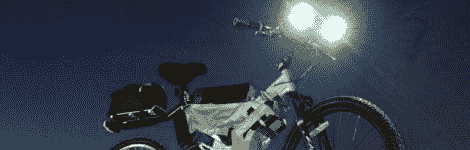
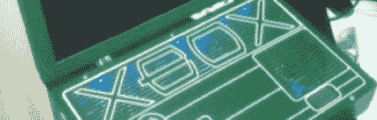
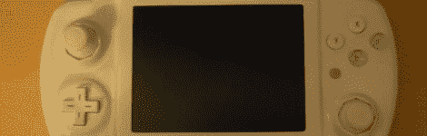
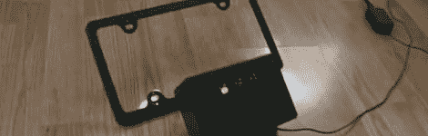
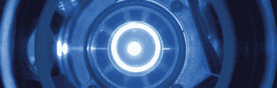

# 黑客链接:4 月 30 日，星期六

> 原文：<https://hackaday.com/2011/04/30/hackaday-links-saturday-april-30th/>

**可行驶 200 多公里的定制 EBike】**

**
**

早在 2008 年，Doctorbass 就用一辆猫鼬自行车制造了一辆很棒的电动自行车。这款自行车最高时速可达 76 公里，一次充电总里程可达 210 公里。某个汽车公司需要马上雇佣这个人。

[通过[使](http://blog.makezine.com/archive/2011/04/custom-ebike-boasts-76-kilometers-per-hour-210-per-charge.html)

**定制 Xbox 360 笔记本电脑**

**
**

[Ed]最近得到了一台数控机床，并立即组装了一台 Xbox 360 笔记本电脑。它们看起来很锋利，如果你感兴趣，他愿意定制一台笔记本电脑。我们认为有人需要组织一场[Ed]和[Ben Heck]之间的比赛。

**一个便携式的 GameCube 来统治他们所有人**

**
**

众所周知，我们喜欢便携式游戏机，而且这款便携式 GameCube 看起来很棒。很明显，很多想法和工作都投入到了这个模型中，它显示了。

[谢谢，Samjc3]

**停车障碍超声波倒车传感器**

**
**

如果你决定不在你的新车上安装备用传感器，[【埃里克的】会帮你搞定](http://amani64.com/park.htm)。他向我们展示了他如何使用 Arduino 和附加可编程逻辑板创建超声波备用传感器。

**巨型激光开始建造**

**
**

欧洲的极限光基础设施项目将开始建造世界上最强大的激光器，功率为 200 皮瓦。科学家们打赌激光能够撕裂空间和时间本身的真空，即使只有几分之一秒。对我们来说，这似乎是一个可靠的计划——可能会出什么差错呢？

[谢谢，科纳斯塔]