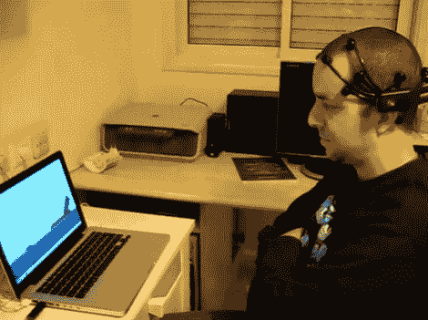

# 用你的思想打鸟杀猪

> 原文：<https://hackaday.com/2011/05/02/flinging-birds-and-slaying-pigs-with-your-thoughts/>

拉斐尔·米兹拉希和阿娜特·桑博认为《愤怒的小鸟》缺少一个关键元素——精神控制。他们为自己的上网本抓了一份游戏拷贝，并给拉斐尔戴上了一个 Emotiv EPOC 耳机，看看他是否能在不使用鼠标或键盘的情况下玩这个游戏。虽然他能够随着自己的想法移动光标，但他发现 Emotiv 的 EmoKey 软件缺乏任何鼠标按钮支持。他们毫不气馁，转向互联网寻求帮助，发现他可以通过另一个应用程序 [GlovePie](http://glovepie.org/) 将 Emotiv 的输出映射到他的鼠标上。

正如你在下面的视频中看到的，他们的努力是成功的，尽管我们怀疑 Rafael 是否会完全放弃他的鼠标。通过更多的改进，我们可以想象 Rafael 会立刻把猪炸上天。

如果您有兴趣亲自尝试，请注意，只有 SDK 版本的 EPOC 耳机可以与第三方应用程序配对，标准消费者版本被锁定为只能使用授权软件。

如果你想看《愤怒的小鸟》神经界面的视频，请继续阅读。

[https://www.youtube.com/embed/WDgkZZYSVPo?version=3&rel=1&showsearch=0&showinfo=1&iv_load_policy=1&fs=1&hl=en-US&autohide=2&wmode=transparent](https://www.youtube.com/embed/WDgkZZYSVPo?version=3&rel=1&showsearch=0&showinfo=1&iv_load_policy=1&fs=1&hl=en-US&autohide=2&wmode=transparent)