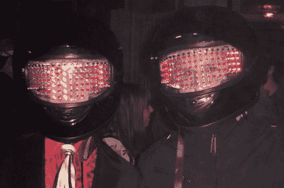

# 受神秘人启发的 LED 矩阵头盔

> 原文：<https://hackaday.com/2011/05/04/led-matrix-helmits-inspiried-by-you-know-who/>

这里有一个来自[约翰项目]的[帖子](http://stuffthatjohnbuilds.blogspot.com/2011/02/daft-punk-style-helmets.html)。疯狂、讽刺和不可思议的 2011 年奥马哈[土拨鼠舞会](http://www.omaha.com/article/20100206/LIVING/702069877)【约翰】和他的伙伴制作了头盔，让人想起我们最喜欢的机器人摇滚歌手。[John]需要比竞争对手更硬、更好、更快、更强的东西，并最终创造了安装在空气动力学摩托车头盔护目镜后面的 LED 矩阵。

这些头盔是在大约一周的时间内以与真头盔相似的方式制成的。[John]采购了一些便宜的摩托车头盔，并将 led、它们的驱动晶体管和镇流电阻安装到 1/32 英寸(柔性)的有机玻璃板上，与佩戴者面对面放置。[John]从在纸模板上画一个半英寸的网格开始，走过了整个过程。使用锡剪从有机玻璃上切割模板，然后使用各种钻头在薄塑料上小心地钻 LED 孔，直到 13/64 英寸。90 多个奇怪的发光二极管被再次安装，然后热粘合到位，焊接在垂直柱上，以简化事情，防止任何短路。一个 [Arduino Pro](http://www.sparkfun.com/products/9219) (通过公共发射器 2n2222 开/关电路)为 18 个 LED 柱提供一些数字爱，并连接到一个 Velleman 声光套件，该套件根据 da funk 调节整个遮阳板的亮度。两个电位计也连接起来，为人类提供灵敏度和模式选择。

我们无法想象，在经历了蒸汽机、高寿命和其他东西太长时间之后，技术设置还是新鲜的。哦，是的，一些更亮的发光二极管可以给头盔提供夜视能力，让整个东西充满感情。我们有些东西在燃烧，想知道头盔的动力是什么。干得好[约翰]！ ~~~~

If you are looking to do some homework on these high fidelity rock’n roll outfits in the prime time of your life check out [this](http://hackaday.com/2009/10/13/daft-punk-replica-helmet/) very detailed [example](http://hackaday.com/2010/07/24/daft-punk-helmet-replica-finally-completed/), a helmet [construction video](http://hackaday.com/2008/12/02/daft-punk-helmet-timelapse/),  or finish the costume off with some [EL wire](http://hackaday.com/2009/03/21/daft-punk-costumes/).

看看这些超级英雄在跳伞后翻滚和抓痒的视频吧！

 <https://www.youtube.com/embed/EzHQuwTD4rQ?version=3&rel=1&showsearch=0&showinfo=1&iv_load_policy=1&fs=1&hl=en-US&autohide=2&wmode=transparent>

 <iframe class="youtube-player" width="800" height="480" src="https://www.youtube.com/embed/mGzPo0fAWR8?version=3&amp;rel=1&amp;showsearch=0&amp;showinfo=1&amp;iv_load_policy=1&amp;fs=1&amp;hl=en-US&amp;autohide=2&amp;wmode=transparent" allowfullscreen="true" style="border:0;" sandbox="allow-scripts allow-same-origin allow-popups allow-presentation"/> </body> </html>