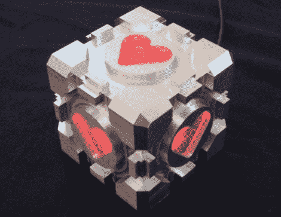

# 一个加权的同伴立方体值得从焚化炉中拯救出来

> 原文：<https://hackaday.com/2011/05/04/a-weighted-companion-cube-worth-saving-from-the-incinerator/>

老实说，很遗憾 Valve 没有向大众发布任何官方门户相关的项目，因为它们的市场显然存在。俗话说“需要是发明之母”，[和【Jamie】最需要一个加权的同伴立方体](http://www.bakamecha.com/Artwork/page32/page32.html)。

事实上，他构建了他的同伴立方体，以测试他在自制数控铣床上进行的一些修改和升级。根据立方体的结果，以及他能够将公差保持在 0.005”以内的事实，我们可以说他的研磨机工作得很好。

立方体是在 Solidworks 中设计的，并通过 BobCAD 插件为工厂生成 GCode。立方体的底座是由一块 3 英寸的实心铝块加工而成的，一边被挖空，以便他能接触到立方体的内部。他在两边磨出心形的开口，用磨砂聚碳酸酯覆盖。

他在混合物中加入一个 BlinkM，将其安装在他为立方体开放面铣出的盖板上。一旦点亮，它就会在几种颜色之间循环，包括玩过传送门的人都很熟悉的粉红色调。

我们会说这是一个伟大的工作，但它没有公平地对待他的工作——它绝对令人惊叹。我们这么说不仅仅是因为我们想要一个，尽管我们确实非常想要一个。