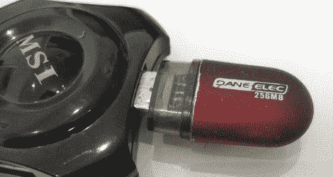

# USB 键盘恶作剧

> 原文：<https://hackaday.com/2011/05/04/usb-keyboard-prankster/>

作为一个长期的恶作剧者，[cyclonite]在一个旧的 USB 闪存驱动器中想出了这个非常聪明的方法。

驱动器已从机箱中取出，备用内存和控制器也已取出。在背面，attiny 2313 粘在 pcb 上，而电阻被交换以与 VUSB 库配合工作。Wirewap 线用于将所有需要的点跨接到背面的新微控制器，并且在末端安装了临时 ICSP 接头以加载软件。

你剩下的是一个看起来很无辜的 usb 驱动器，当插入时，它会将自己设置为一个键盘，然后每隔几分钟就会触发受害者电脑上的大写锁定。经典。

休息之后，请加入我们，观看一段简短的视频。

 <https://www.youtube.com/embed/ZYB36Ds8Y8Y?version=3&rel=1&showsearch=0&showinfo=1&iv_load_policy=1&fs=1&hl=en-US&autohide=2&wmode=transparent>

 </body> </html>