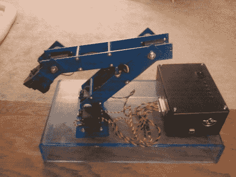

# 带搅拌机的实时机械臂控制

> 原文：<https://hackaday.com/2011/05/04/real-time-robotic-arm-control-with-blender/>

去年，贾斯汀·戴利(Justin Dailey)作为一名计算机工程专业的学生进入了大四的最后阶段，他需要完成一个最终设计项目。他一直想建造一个机器人手臂，并认为没有比声称这是“家庭作业”更好的方法来使这个项目合法化。

虽然他最初想用操纵杆控制手臂，但在他的最终项目之前，他一直在摆弄 Blender，并认为让 Blender 来做这项工作会很酷。他首先测试自己用 Blender 控制单个伺服系统的能力，然后慢慢增加项目的复杂性。他用纸板制作了手臂的原型，并对目前的进展感到满意，开始用铝制作手臂。

一旦他将所有六个伺服系统连接到手臂的关节上，并连接到他的机器人上，他就开始忙着在 Blender 中构建 3D 模型。使用几个 Python 脚本，Blender 内部的运动被实时转换为串行数据，这些数据被转发给 Roboduino 以控制手臂。

如果有机会，请访问他的网站——那里有大量的代码，以及几个处于不同构建和测试阶段的手臂视频。