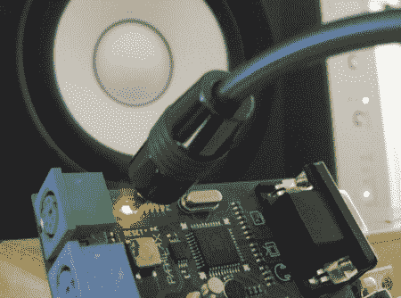

# 视差推进器上的数字音频

> 原文：<https://hackaday.com/2011/05/06/digital-audio-on-the-parallax-propeller/>

[Beth]几年前就有了在螺旋桨上通过 PDIF 传输数字音频的想法，但只是停留在一篇文章[上](http://scanlime.org/2011/04/spdif-digital-audio-on-a-microcontroller/)。为此，我们感谢她。

这篇文章对 S/PDIF 协议以及与产生信号相关的问题进行了精彩的介绍。S/PDIF 是一种相对资源密集型的协议，信号的时钟频率是音频采样速率的 64 倍。对于[双相标志码](http://en.wikipedia.org/wiki/Biphase_mark_code)，该信号加倍，保持一切同步。[Beth]说微控制器至少需要 24 MIPS 的处理能力来产生 S/PDIF 信号——处理音频完全是另一项任务。由于所需的处理能力，以及所需的*怪异*时钟频率，[贝丝]决定用螺旋桨。该实现只使用了 Propeller 的一个内核，剩下的七个内核可用于声音合成，甚至是 VGA 上的可视化。

[Beth]承认几乎任何微控制器都可以做到这一点(尽管对于 32kHz 的音频流，它需要以 4.096 MHz 的倍数进行时钟控制)，但我们真的很欣赏对该信号进行位碰撞的工作。

[Nick]在 Gadget Gangster 的视频，休息后，他在螺旋桨上播放数字音频。

<https://player.vimeo.com/video/19992819>

 </body> </html>