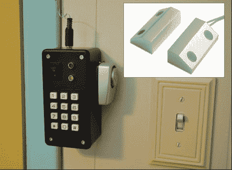

# 模块化安全系统也是便携式的

> 原文：<https://hackaday.com/2011/05/05/modular-security-system-is-portable-too/>

Hackaday reader [Oneironaut]来信分享了他为自己打造的模块化便携式安全系统。

他喜欢去加勒比海，但他最喜欢的度假地点显然是猫贼横行的地方。他喜欢开着窗户睡觉，并想找到一种方法来吓走尼多威尔斯。在家里，他拥有的房产上有几栋不同的建筑，他想把好奇的侵入者赶走。

该报警系统是使用矩阵键盘与 ATMega88 微控制器接口构建的。微控制器处理系统的所有逻辑，当传感器跳闸时，触发附加的“袖珍警报”。像大多数家用报警器一样，它通过键盘启动和解除，如果报警器被误触发，用户可以在 60 秒内输入解除密码。可以使用各种触发方法，从水银开关到运动探测器，因为他的报警器使用简单的插头接口，可以接受任何双线传感器。

现在，没有人声称这是高度安全的——警报解决了几个适用于[Oneironaut]的特定场景，这可能也适用于其他人。在一天结束时，警报更多的是为了吓唬入侵者逃离，而不是其他任何东西，在这方面，它的工作非常完美。

继续阅读，观看他的报警系统运行的快速视频演示。

[https://www.youtube.com/embed/k20qBRfN_hw?version=3&rel=1&showsearch=0&showinfo=1&iv_load_policy=1&fs=1&hl=en-US&autohide=2&wmode=transparent](https://www.youtube.com/embed/k20qBRfN_hw?version=3&rel=1&showsearch=0&showinfo=1&iv_load_policy=1&fs=1&hl=en-US&autohide=2&wmode=transparent)