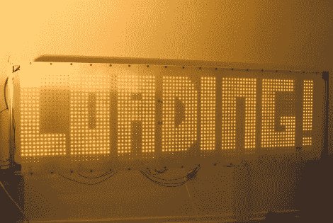

# 光子旗帜

> 原文：<https://hackaday.com/2011/05/07/photon-banner/>

不久前为我们带来“双人桌”的 2011 版演示派对，以及一些 PC、复古和艺术的超级演示，也为我们带来了[光子横幅](http://translate.google.com/translate?js=n&prev=_t&hl=en&ie=UTF-8&layout=2&eotf=1&sl=auto&tl=en&u=http://www.crafted.de/photonenbanner.php&act=url)(谷歌翻译)。光子横幅是一个 96X24 的 led 矩阵，由(当然)2304 个 5 毫米的 led 和一个时钟频率为 20MHz 的 atmega 644 制成。

最终结果是一个 192 厘米 X 48cm 厘米的显示区域，它使用了单个微控制器，并通过 2 兆 SPI 闪存、6 个驱动板得到了增强，仅构建就花了大约一个月的时间。驱动该节目的软件又花了 15 天，这真是令人印象深刻。

上面的网站包含了一堆照片、零件清单和原理图。在你离开之前，你应该在休息之后加入我们，看几个短片。

 <https://www.youtube.com/embed/XgEYBqEIDEY?version=3&rel=1&showsearch=0&showinfo=1&iv_load_policy=1&fs=1&hl=en-US&autohide=2&wmode=transparent>

 <iframe class="youtube-player" width="800" height="480" src="https://www.youtube.com/embed/LWY_jnurgo0?version=3&amp;rel=1&amp;showsearch=0&amp;showinfo=1&amp;iv_load_policy=1&amp;fs=1&amp;hl=en-US&amp;autohide=2&amp;wmode=transparent" allowfullscreen="true" style="border:0;" sandbox="allow-scripts allow-same-origin allow-popups allow-presentation"/> </body> </html>