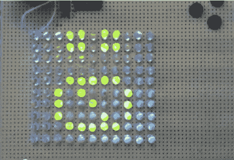

# 利用中断提高 Charlieplexing 性能

> 原文：<https://hackaday.com/2011/05/06/improve-charlieplexing-performance-with-interrupts/>

[Dmitry]正在购买发光二极管，不小心按错了型号。既然他不想浪费，他想他至少应该花时间用它们来建造一些东西。

LED 矩阵显示器是显而易见的项目选择，但他只有一个 PIC16F688 可供使用。由于微控制器只有 11 个输出引脚，charlieplexing 是他点亮整个矩阵的唯一方法。

在测试他的 LED 阵列时，他发现 charlieplexing 有点令人失望。事实上，发光二极管可以变得相对暗淡，这取决于在任何特定时间点亮的单元数量，这让他感到恼火。

为了提高他的 charlieplexed 阵列的性能，他首先决定扫描所有的 led，而不仅仅是那些需要点亮的 led。这确保了他所有的发光二极管具有相同的 1/110 占空比，并且总是尽可能的亮。他还选择在点亮 led 时使用中断。这意味着他的代码不需要考虑任何特定的时间要求来保持视觉的持续性。他还对显示器进行了双重缓冲，以帮助减少闪烁。

他说，他在选择 PIC 芯片时遇到了某些限制，所以他使用了一些查找表来确保显示器的平稳运行。他对结果非常满意，我们认为从我们的角度来看，中断驱动的显示看起来也很好。

请务必留下来观看解释和演示他的单芯片 LED 矩阵的快速视频。

[https://www.youtube.com/embed/yRYOYJx8LsI?version=3&rel=1&showsearch=0&showinfo=1&iv_load_policy=1&fs=1&hl=en-US&autohide=2&wmode=transparent](https://www.youtube.com/embed/yRYOYJx8LsI?version=3&rel=1&showsearch=0&showinfo=1&iv_load_policy=1&fs=1&hl=en-US&autohide=2&wmode=transparent)