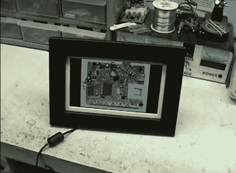

# 数码相框逆向工程

> 原文：<https://hackaday.com/2011/05/07/digital-picture-frame-reverse-engineering/>

几个月前,[Jason]得到了一个免费的克比 DP700WD 数码相框[,他认为黑进这个相框会很有趣。在意识到这个框架不能运行任何基于 Linux 的操作系统后，他觉得自己的选择非常有限，但他还是试了一下。](http://sites.google.com/site/jrspruitt/main/photoframe-hack)

这个相框带有一组内置图像，他的目标是把它们换成自己的照片。他开始尝试从框架的串行闪存芯片中读取数据，但发现处理器阻止了他这样做。他将芯片从框架上拆下，安装在一个临时的分线板上，并开始读取 SPI。

他最终能够读取该设备的闪存芯片，并将内置图像与自己的图像进行交换。经过一段时间的反复试验，他也能够用自己定制的图像替换框架的启动屏幕。

如果你想做类似的事情，一定要去他的网站看看——他用来破解他的框架的所有工具和代码都是现成的。

继续阅读，看看他的修改画框的行动。

 <https://www.youtube.com/embed/xevG0ZCW-Fo?version=3&rel=1&showsearch=0&showinfo=1&iv_load_policy=1&fs=1&hl=en-US&autohide=2&wmode=transparent>

 </body> </html>