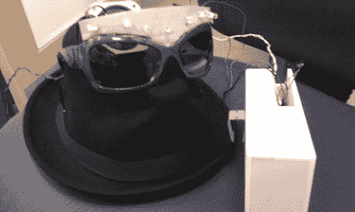

# 丽贝卡·布莱克跑步配件也为听力范围内的每个人推广跑步

> 原文：<https://hackaday.com/2011/05/07/rebecca-black-running-accessory-also-promotes-running-for-everyone-within-earshot/>

上周五，我们听到了[gvillenave]的跑步配饰的风声，灵感来自丽贝卡·布莱克，我们非常激动，我们非常激动能在周五之后的周六将它带给你们。

[gvillenave]想出了一个主意，用一首“星期五”的烦恼程度来鼓励跑步者保持良好的速度。这个概念很简单:如果佩戴者跑得快，歌曲就会加快速度。如果佩戴者放慢了速度，歌曲就会放慢速度，延长痛苦。

该建筑使用 Arduino 和[ladyada]的[波盾](http://www.ladyada.net/make/waveshield/)耦合到加速度计。[gvillenave]包括了代码，还在一副太阳镜上连接了一些发光二极管，当跑步者的速度增加时，它们会更频繁地闪烁。wave shield 有一个 3.5 毫米的耳机插孔，但[gvillenave]优雅地连接了一个扬声器，“这样你就可以打扰你周围的人，而不仅仅是你自己。”所有这些都被包装在一个非常漂亮的 3D 打印外壳中，成为一个伟大的*外观的*项目。

没有关于[gvillenave]的负强化方面的有效性的消息，但我们怀疑它会帮助她每天早上更快地到达公交车站。