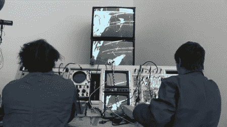

# Synkie:视频模块合成器

> 原文：<https://hackaday.com/2011/05/08/synkie-the-modular-synth-for-video/>

[anyma]的工作人员已经研究了一个叫做[syn kie](http://www.anyma.ch/research/synkie/)的模拟视频处理器有一段时间了，我们很惊讶这个如此棒的项目已经与我们擦肩而过这么久了。

像 Moog 或 Doepfer synth 一样，Synkie 在开发时考虑了模块化。到目前为止，[anyma]已经建立了分离和组合同步和视频信号的模块，以及反转、加、减、混合、过滤和放大这些信号的模块。所有这些视频处理的最终结果产生了一个输出，看起来像一个故障雅达利，艺术装置，和加扰的有线电视台在同一时间。

Synkie 的输出让我们想起了[最初的神秘博士标题序列](http://www.youtube.com/watch?v=kvKezE1hZeI#t=24)，实际上这个想法并不离谱——两者都使用视频反馈，将产生任何东西，从变幻莫测的“穿越空间”美学到分形 [Droste 效应](http://en.wikipedia.org/wiki/Droste_effect)可视化。我们对 Synkie 的能力印象深刻，但我们对[anyma]剧组实时控制视频信号以获得他们想要的东西的能力感到震惊。

查看跳跃后的 Synkie 视频。在 [Synkie Vimeo 频道](http://vimeo.com/channels/synkie)上也有更多 Synkie 行动的镜头。

<https://player.vimeo.com/video/23081064>

 </body> </html>