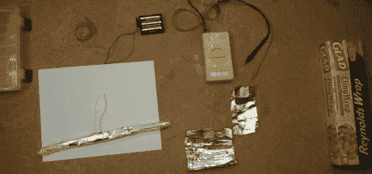

# 滚动你自己的电容器

> 原文：<https://hackaday.com/2011/05/09/roll-your-own-capacitors/>

滚动自己的电子元件可能很有趣，但也有助于解释某些项目实际上是如何工作的。来自玩具制造商的[Addie]最近通过制作自己的开始研究电容器的工作原理。

她了解电容器背后的一般概念以及它们是如何构成的，但她想亲眼看看是如何做到的。为了制造她的电容器，她选择铝箔作为导体，saran wrap 作为电介质。她承认她的第一次尝试是失败的，但她毫不气馁，继续下去。朋友们认为她的导体太小了，无法容纳任何合理的电荷，所以她尝试了更大的铝箔片，但无济于事。

她坚持不懈，在用几英尺厚的箔片制作电容器后获得了成功。她用一把 AA 电池给它充电，当她触摸盖子上的导线时，她兴奋地看到她的万用表开始工作了。

虽然你可能不会在下一个产品中使用手工制作的电容器，但对有兴趣学习电子产品的孩子来说，这是一个有趣的实验。

[via [Adafruit 博客](http://www.adafruit.com/blog/2011/05/06/diy-capacitor/)

 <https://www.youtube.com/embed/LlqmUVw5iZE?version=3&rel=1&showsearch=0&showinfo=1&iv_load_policy=1&fs=1&hl=en-US&autohide=2&wmode=transparent>

 </body> </html>