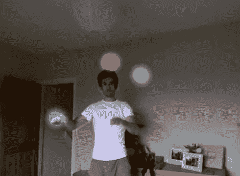

# 用 Kinect 玩杂耍

> 原文：<https://hackaday.com/2011/05/09/juggling-with-kinect/>

我们在这里介绍的一些 Kinect hacks 在辅助生活领域非常有用，其他一些展示了视频滤镜的巧妙应用可以做些什么。有些……只是单纯的乐趣。

这对 Kinect 黑客不一定会赢得任何有用的奖项，但他们很有趣。[【Tom】开发了一个简洁的杂耍应用程序](http://code.google.com/p/kinect-juggle/)，它可以观察你的手在背后消失，一旦它们回到相机的视野中，就会产生一个发光的球。正如你在下面的视频中看到的，这些球可以被扔掉或变戏法。这看起来会很有趣，而且肯定比在学习变戏法的时候追着球跑要容易得多。

[Tom]的攻击是基于他在 YouTube 用户[hogehoge335]的视频中看到的代码。他的 Kinect 应用程序[允许他复制龙珠 Z 的 Kamehameha 攻击](http://code.google.com/p/kinect-kamehameha/)、飘动的头发等等。

看看下面的视频，看看这两个 Kinect 黑客的演示，如果你想试试的话，可以浏览一下各自的 Google Code 网站。

 <https://www.youtube.com/embed/9AXpnlkqPCI?version=3&rel=1&showsearch=0&showinfo=1&iv_load_policy=1&fs=1&hl=en-US&autohide=2&wmode=transparent>

 <iframe class="youtube-player" width="800" height="480" src="https://www.youtube.com/embed/lajP7HO7ZyE?version=3&amp;rel=1&amp;showsearch=0&amp;showinfo=1&amp;iv_load_policy=1&amp;fs=1&amp;hl=en-US&amp;autohide=2&amp;wmode=transparent" allowfullscreen="true" style="border:0;" sandbox="allow-scripts allow-same-origin allow-popups allow-presentation"/> </body> </html>