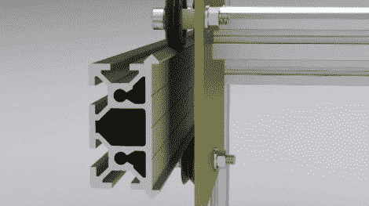

# 开源线性轴承系统

> 原文：<https://hackaday.com/2011/05/10/open-source-linear-bearing-system/>

虽然我们通常不习惯展示 Kickstarter 项目，但我们不能错过这个。来自 BuildLog.net 的[Barton Dring]正在组织一个名为 maker slide 的项目，我们相信你们当中的许多人会对此感兴趣。

通过他的各种 CNC 构建，他发现获得更昂贵和令人沮丧的组件之一是线性轴承系统。他指出，商业系统是昂贵的，虽然偶尔可以找到易贝的便宜货，但这不是处理事情的理想方式。他还指出，自制系统通常在一些调整和调节后工作，但构建起来可能会很耗时。

他提出了一种 v 形槽轴承系统，包括由 Delrin 制成的车轮，作为上述所有解决方案的标准化替代品。他预计铁轨的售价约为每厘米 10 美分，一个 4 英尺长的系统的平均成本约为 20 美元。

作为奖励，他向任何向他发送“新的、创新的或有趣的开源设计或使用该材料的基本想法”的人提供免费的 MakerSlide 材料。你只需支付运费，就能让你的新项目顺利启动。

标准化总是好的，看到这个 rail 系统投入生产肯定会让黑客社区受益。如果你愿意的话，花一分钟去看看。