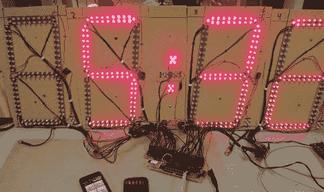

# 廉价的开源节奏时钟让你的练习按计划进行

> 原文：<https://hackaday.com/2011/05/10/cheap-open-source-pace-clock-keeps-your-practice-on-schedule/>

从游泳到田径，各种各样的运动都使用计步器。然而，这些系统通常非常昂贵，通常超出了小型组织和资金不足的项目的能力范围。康奈尔大学的学生(Paul Swirhun 和 Shao-Yu Liang)开始为他们的电子和计算机工程期末项目建造一个比商业步速钟便宜得多的替代品，并配备简单得多的无线用户界面。

他们的时钟使用 ATmega32a 来处理所有的处理，并与 RN-42 蓝牙模块配对，用于与 Android 智能手机通信。他们的七段显示器是使用他们为该项目设计和制造的定制 PCB 构建的，由 TLC5940NT LED 驱动器控制。Android 软件允许用户远程连接到步速时钟，创建任何类型的多层游泳或跑步例程。

当项目完成时，两人计算出在低产量下他们的总硬件成本低于 250 美元。即使考虑到组装时间，他们的解决方案也比类似的商业系统便宜几个数量级。

如果你有兴趣看他们最终产品的演示视频，请留下来。

[https://www.youtube.com/embed/CUm3Ny9dtQA?version=3&rel=1&showsearch=0&showinfo=1&iv_load_policy=1&fs=1&hl=en-US&autohide=2&wmode=transparent](https://www.youtube.com/embed/CUm3Ny9dtQA?version=3&rel=1&showsearch=0&showinfo=1&iv_load_policy=1&fs=1&hl=en-US&autohide=2&wmode=transparent)