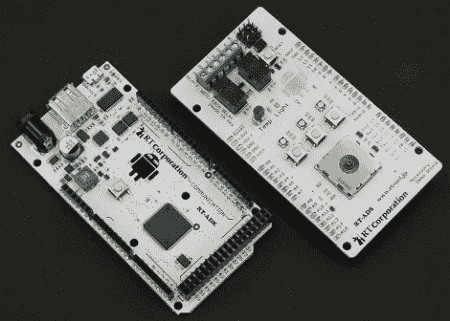

# 官方 Android 开放附件开发套件——这是一个 Arduino

> 原文：<https://hackaday.com/2011/05/11/official-android-open-accessory-development-kit-its-an-arduino/>

在谷歌 I/O 2011 开发者大会上，一个新的用于 android 的开发套件亮相，*官方*支持 Arduino。

这看起来像谷歌从 [Circuits@Home](http://www.circuitsathome.com/arduino_usb_host_shield_projects) 得到了一个提示，因为这个开发套件有趣的部分是这个盾可以进入 USB 主机模式的事实。这对于本身不能充当 USB 主机的手机和平板电脑来说非常好。谷歌也将在 3.1 版本中发布 Android/Arduino mashup 的 API，但谢天谢地，它会被移植到 Gingerbread。

我们上个月报道了 Android 的 IOIO 分线板，但是谷歌的分线板将基于 Arduino Mega 2560，这是一款功能更强的设备。有趣的是，这款主板似乎已经在[上市](http://www.rt-shop.sakura.ne.jp/rt-shop/index.php)，售价约为 400 美元。我们不确定业余爱好者会以这个价格购买它。

虽然这种主板不会做任何你以前用蓝牙盾做不到的事情，但很高兴看到有一家公司支持所有的构建者。