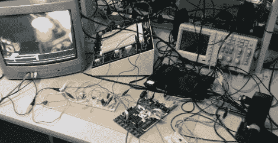

# 自动化摇滚乐队人声

> 原文：<https://hackaday.com/2011/05/11/automating-rock-band-vocals/>

说到摇滚乐队，我们的朋友唱歌很烂。不，真的。

我们不介意他们完全在业余时间敲鼓，但他们试图唱“汤姆·索亚”的声音让我们想割掉我们的耳膜。

我们敢打赌康奈尔大学的学生(高塔姆·卡马斯和多米尼克·格罗乔维纳)有像我们这样的朋友。他们的电子和计算机工程最终项目[旨在消除麦克风前的音盲，让计算机代替演唱](http://people.ece.cornell.edu/land/courses/ece4760/FinalProjects/s2011/dsg88_gck43/dsg88_gck43/index.html)。

由于摇滚乐队只是简单地监听要唱的适当频率，两人认为监控游戏的输出并将计算机生成的信号反馈到麦克风是足够容易的。一旦游戏的声音栏通过一系列过滤器被隔离，ATMega644 就被用来解释音符并通过扬声器产生相应的音调。

虽然自动化摇滚乐队的游戏并不是什么新鲜事，但我们不记得看到过有人试图将歌手从乐队中剔除。我们认为这是一个非常酷的概念——摇滚起来！

编辑:用视频更新

 <https://www.youtube.com/embed/wc-qScQR5uY?version=3&rel=1&showsearch=0&showinfo=1&iv_load_policy=1&fs=1&hl=en-US&autohide=2&wmode=transparent>

 </body> </html>