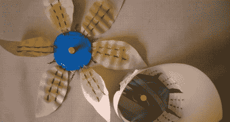

# 纸艺花教孩子电池知识

> 原文：<https://hackaday.com/2011/05/12/papercraft-flowers-teach-kids-about-batteries/>

[Emily Daniels]教授面向儿童的互动电子研讨会已经有一段时间了，最近举办了一场会议[，展示了电池如何以一种非常新颖的方式工作](http://www.emilydaniels.com/2011/05/lcrc-homemade-papercraft-batteries-workshop/)。

由于班级的规模，她想保持安全和简单，所以她不想依赖使用烙铁进行演示。相反，她通过用纸花、盐水和发光二极管构建简单的伏打电池，向孩子们展示了电池的工作原理。纸花的吸收能力被用来作为装饰每个花瓣的线对之间的盐桥。在每一片花瓣上都涂上盐水后，安装在中央的 LED 灯就活了过来，这让她的同学们大为惊讶。

这个概念很简单，LED 花也很容易制作，[你可以在她的 Instructables 教程](http://www.instructables.com/id/Salt-Water-Powered-Paper-Lights)中看到。

我们认为这是向孩子们展示这些简单概念的好方法，并希望看到更多这样的例子。

[via [Adafruit 博客](http://www.adafruit.com/blog/2011/05/11/salt-water-paper-powered-lights/)