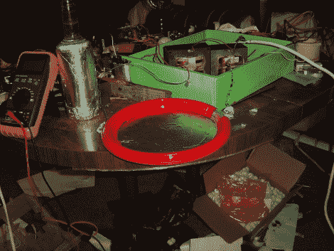

# 塑料板电容器

> 原文：<https://hackaday.com/2011/05/12/plastic-plate-capacitors/>

本周，我们展示了一些自制的电容器，[Mike]来信与我们分享了他的电容器。虽然卷式电容很好，但随着电容和电压的增加，它们可能难以构建和增大到难以处理的尺寸。他的解决方案是用塑料板把这些层堆叠起来。

在这篇论坛帖子中，他解释说，使用一次性塑料板和锡纸，你可以快速制作一个电容器，对他来说，使用 11 层电容器的价值约为 12.2nF。对电池堆电容施加的压力增加到大约 14nF，尽管他用胶水固定它有点困难。

测试是用高电压给电容器充电，然后将它的引线短路，以产生一个好的火花和一个好的爆音。对下一个家庭烹饪来说肯定很有趣，尽管我们不知道一些剩下的土豆沙拉粘液会对最终结果产生什么影响。