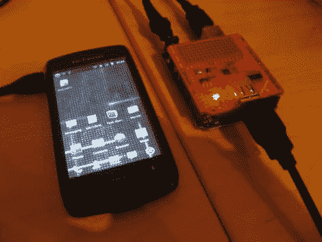

# 在标准 Arduino 硬件上使用谷歌的 ADK

> 原文：<https://hackaday.com/2011/05/13/using-googles-adk-on-standard-arduino-hardware/>

当我们听说 Google 的开放附件开发标准即将推出时，我们非常兴奋。然而，当我们听说参考硬件套件的价格接近 400 美元时，我们的想法变成了，“你肯定不是认真的。”

嗯，谷歌是非常严肃的(我们听说他们也不喜欢别人叫他们雪莉。)

有了如此荒谬的要价，有人尝试在普通 Arduino 硬件上运行 ADK 软件只是时间问题。[【Inopia】写信让我们知道他就是这么做的](http://romfont.com/2011/05/12/google%E2%80%99s-open-accessory-development-kit-on-standard-arduino-hardware/)。

使用 Arduino Uno 和 Sparkfun USB 盾，他能够毫不费力地让 ADK 正常工作。他调整了 ADK 固件映像，以绕过谷歌做的几个硬编码 pin 分配，他准备好了。图像启动得很好，虽然他不一定能保证他的设置与 Android 手机兼容，因为他目前没有一个支持附件模式的手机。

现在，几乎任何人都可以以合理的价格得到 ADK，我们期待着看到你能把什么放在一起！