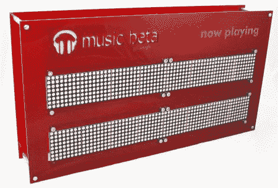

# 谷歌 ADK 项目展示了它的易用性

> 原文：<https://hackaday.com/2011/05/16/google-adk-project-shows-just-how-easy-it-is-to-use/>

大约在 I/O 大会上宣布之前一周，[yergacheffe]得到了一个闪亮的新谷歌 ADK 板，并忙着组装一个整洁的项目来展示 ADK 的一些功能。他的想法是将 ADK 和谷歌的新音乐服务融合在一起，他说这两个项目可以很好地互补。

他有一些去年 Maker Faire 遗留下来的 LED 矩阵，他决定将其用作谷歌音乐元数据显示。显示屏的底部由激光切割的丙烯酸制成，几个备用的 ShiftBrites 照亮了谷歌音乐测试版的标志。

他说，让他的 Android 手机与显示屏对话只需要几行代码——这证明了使用 ADK 是多么容易。

几乎任何人都可以走上前去，连接他们的手机，并在显示屏上看到他们当前的音乐曲目，没有任何大惊小怪，你可以在下面的视频演示中看到。

[https://www.youtube.com/embed/v_bWOUUv8zo?version=3&rel=1&showsearch=0&showinfo=1&iv_load_policy=1&fs=1&hl=en-US&autohide=2&wmode=transparent](https://www.youtube.com/embed/v_bWOUUv8zo?version=3&rel=1&showsearch=0&showinfo=1&iv_load_policy=1&fs=1&hl=en-US&autohide=2&wmode=transparent)