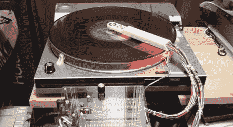

# 恢复 Optigan 光盘格式

> 原文：<https://hackaday.com/2011/05/16/resurrecting-the-optigan-disc-format/>

Optigan 和 Orchestron 是 Mattel 在 20 世纪 70 年代制造的一对电子琴，它们使用可交换光盘来存储乐器信息。这些椎间盘今天仍然可以找到，但器官非常稀少，这让甘很沮丧。在对风琴进行了一番研究后，他决定或许可以[为音频光盘建立自己的 MIDI 兼容接口](http://gaje.jp/projects/synth_effect/optical_organ_e/)。

光盘上印有音频波形数据，可以通过光盘一面的 LED 和另一面的光电晶体管读取。在成功地制作出可以解读光盘音频轨道的阅读器原型后，他构建了一个可以同时读取所有轨道的设备，就像原始器官一样。

他的临时转盘是在一个旧唱机的顶部建造的，使用丙烯酸圆盘和玩具车轮来保持稳定。一旦光盘被放在转盘上，他就把他的阅读器放在适当的位置，通过一些定制的电路，他就可以用他更现代的键盘来播放光盘。正如你在下面的视频中看到的，这听起来相当不错，尽管他承认他想做一些调整，让它听起来更好。

[谢谢布莱恩]

[https://www.youtube.com/embed/KmP-BKYvPzg?version=3&rel=1&showsearch=0&showinfo=1&iv_load_policy=1&fs=1&hl=en-US&autohide=2&wmode=transparent](https://www.youtube.com/embed/KmP-BKYvPzg?version=3&rel=1&showsearch=0&showinfo=1&iv_load_policy=1&fs=1&hl=en-US&autohide=2&wmode=transparent)