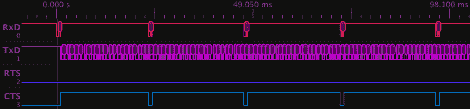

# AVR 的硬件握手

> 原文：<https://hackaday.com/2011/05/17/hardware-handshaking-for-avr/>

串行通信仍然是我们嵌入式世界的重要组成部分。通常我们使用三线设置(RX TX 和地),希望一切按计划进行。虽然这对大多数实验者都有效，但有时这并不是最理想的情况。这就是[simmonmt]在 AVR 中添加硬件握手的地方。

硬件设置非常典型，Atmega644 位于连接的一端，经过 [SP3232EB](http://www.exar.com/Common/Content/ProductDetails.aspx?ID=484&ParentID=6#) 电平转换器，输出到 PC。使用 5 条线路，同样一条用于 RX、TX 和地，但也用于 RTS 和 CTS。当 PC 准备好传输数据时，它反转线路(通常保持高电平)，微控制器注意到这一点，它将 CTS 拉低，传输可以在任何时候开始。得心应手！