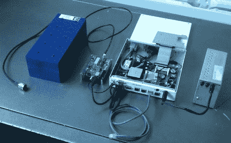

# 电视空白频段上的最后一英里 WiFi

> 原文：<https://hackaday.com/2011/05/17/last-mile-wifi-over-tv-white-space/>

当你买不起宽带，免费 WiFi 又遥不可及的时候，你会怎么做？

这是莱斯大学研究生瑞安·格拉负责解决的问题。一名休斯顿当地居民几乎无法接入她所在地区提供的免费服务，因此[Ryan]开始利用以前被电视信号占据的空白区域来扩大信号范围。

使用工作在 563MHz 的 29 频道，他的“超级 WiFi”项目利用标准 WiFi 协议，可以将信号的覆盖范围扩大到一英里。最近的发射塔的 WiFi 信号通过原型频率转换器传输，将信号从 2.4GHz 降至 563MHz，这更适合长距离传输。该系统目前还没有使用信道绑定，所以它被限制在使用 WiFi 最大带宽的 25%左右，这远远好于完全没有信号。

虽然电视空白的广泛实际应用还需要一段时间才能开花结果，但这无疑是朝着正确方向迈出的一步。

[谢谢克里斯]