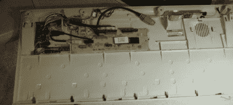

# 优步键盘将安全工具隐藏在众目睽睽之下

> 原文：<https://hackaday.com/2011/05/18/uber-keyboard-hides-security-tools-in-plain-sight/>

[EverestX]在安全行业工作，由于各种原因，经常需要恢复或渗透各种系统。他希望[创造一个多功能的工具](http://soldierx.com/bbs/My-Crashcart-Uber-Keyboard),可以方便地从一个工作带到另一个工作，为他提供几个基本功能。他要求该设备包含一个可引导的操作系统，通过该系统他可以执行工作，具有能够进行注射的互联网连接，并且具有足够的存储容量来备份密码、图像等。

他决定在一个旧的 IBM 型键盘内构建系统，这为他的各种组件提供了可靠的输入体验和大量的空间。在将键盘从 PS/2 转换为 USB 后，他安装了一个 USB 集线器以及他的闪存盘和 WiFi 卡。

一旦他把所有的东西都重新组装好，这应该会是一个非常隐蔽和有用的设备。给聪明人一个忠告——如果你碰巧看到有人拿着一个 20 年前的 Type-M 键盘在你的办公室里鬼鬼祟祟，要警惕。