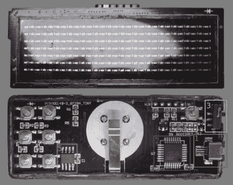

# 逆向工程一个廉价的 LED 信息字幕

> 原文：<https://hackaday.com/2011/05/19/reverse-engineering-a-cheap-led-message-marquee/>

[Hugo]全力以赴地分享他的发现，同时对这个小 LED 罩进行逆向工程。他以不到 12 美元的价格购买了 29×7 LED 矩阵，但惊讶地发现 USB 连接器不是标准类型，并且没有电缆。他首先将一个标准连接器焊接到位，然后[着手让设备按照他的吩咐](http://www.digitalspirit.org/blog/index.php/post/2011/05/18/Hacking-d-un-%C3%A9cran-%C3%A0-Led-de-DealExtreme) ( [翻译](http://translate.google.com/translate?hl=en&sl=auto&tl=en&u=http%3A%2F%2Fwww.digitalspirit.org%2Fblog%2Findex.php%2Fpost%2F2011%2F05%2F18%2FHacking-d-un-%25C3%25A9cran-%25C3%25A0-Led-de-DealExtreme))。

他的成就可以在休息后的视频中看到。他现在可以通过 USB 电缆连接到设备上，向它发送新信息并调整它的滚动速度。他还可以调整字母之间的间距，反转滚动方向，读取板上的按钮，并将设置写入设备的 EEPROM。这都要归功于[Hugo]为 ATmega88 编写的一些替代固件。你可以从他整理的维基页面 ( [翻译的](http://translate.google.com/translate?hl=en&sl=auto&tl=en&u=http%3A%2F%2Fwww.digitalspirit.org%2Fwiki%2Fprojets%2Fledmatrixhacking))下载该代码的副本。我们真的很感谢他花时间整理这一页。他在黑客攻击过程中收集的大量信息是与世界分享您的项目的最佳方式。

【维梅奥 http://vimeo.com/22774505 w = 470】