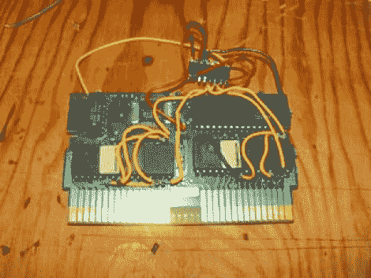

# NES 多弹药筒

> 原文：<https://hackaday.com/2011/05/19/nes-multi-cartridge/>

这是[卡兰·布朗]为最初的 NES 做的一个 mutlicartridge hack。他花了一些时间窥探上面电路板上的信号，直到他发现了映射游戏控制台复位信号的轨迹。这将用于循环播放存储在购物车内存芯片中的各种游戏。将存储在该盒式磁带上的 ROM 图像连接起来，然后烧录到 EPROM 中。由于施主盒(和选择的 rom)使用存储器管理，硬件可以被欺骗从 EPROM 中的特定点读取 ROM。

开关本身由 74HC161 二进制计数器芯片处理。来自板上安全芯片的复位信号充当计数器的时钟触发器。一些巧妙的布线允许计数器的输出为 EPROM 选择起始地址。每按一次 reset 按钮，计数器就增加一次，从而选择不同的 ROM 进行加载。见【Callan】在休息后的视频中演示完成的黑。

 <https://www.youtube.com/embed/jlYERtcknKc?version=3&rel=1&showsearch=0&showinfo=1&iv_load_policy=1&fs=1&hl=en-US&autohide=2&wmode=transparent>

 </body> </html>