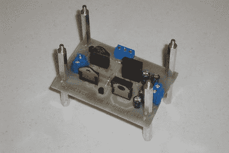

# H 桥电机控制器简介

> 原文：<https://hackaday.com/2011/05/20/introduction-to-the-h-bridge-motor-controller/>

[Chris]向我们发送了这个精彩的教程，[向初学者介绍 H 桥电机驱动器](http://www.pyroelectro.com/tutorials/h_bridge_4_transistor/)。虽然你们中的许多人会认为这是基本的东西，但是那些试图从只构建 arduino 板可以处理的东西扩展到更大更昂贵(和强大)的项目的人会发现这很有帮助。[Chris 的]教程非常深入，不仅介绍了基本电路的构造，还向您展示了如何制作自己的 PCB。到那边去，学些理论和实践。然后你就可以建造你一直梦想的战斗机器人了！