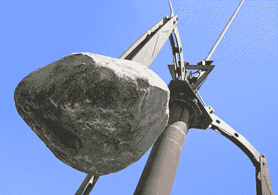

# 湾区创客集会:黑客日已经到来！

> 原文：<https://hackaday.com/2011/05/20/bay-area-maker-faire-hackaday-has-arrived/>

在 2011 年湾区创客博览会上，这里已经是一个疯人院了。虽然该节目明天才正式开始，但周五是“教育日”，这是当地学校的特别预演。当制造商们争先恐后地布置他们的展示时，一千个敏感的年轻人寻求太鼓鼓声、ArcAttack 的[音乐特斯拉线圈](http://hackaday.com/2008/06/12/singing-tesla-coils/)和*哔哔声*和*哔哔声*的最不和谐的混合 [R2-D2 建筑者俱乐部](http://hackaday.com/2010/05/27/bamf2010-look-sir-droids/)。

Maker Faire 将在圣马特奥活动中心举办第六届，并将比以往任何时候都更大、更有趣。我们将尽最大努力在周末提供一些实时更新。像往常一样，[查看官方网站](http://makerfaire.com/)了解时间、入场、停车，尤其是公共交通选择。

(图片:*巨像，*集会中途区域的死亡挑战中心。)