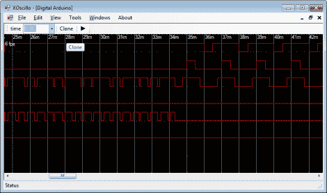

# Xoscillo 在示波器中转动 Arduino

> 原文：<https://hackaday.com/2011/05/21/xoscillo-turns-arduino-in-an-oscilloscope/>

如果你没有示波器，你会惊讶地发现自己需要一个。但是如果你手头有一个 Arduino，下一次你也许可以使用这个[软件套件，它可以使用开发板作为示波器输入](http://code.google.com/p/xoscillo/)。该项目被称为 xoscillo，它允许 Arduino，或[视差 USB 示波器](http://www.parallax.com/Store/Microcontrollers/BASICStampProgrammingKits/tabid/136/ProductID/46/List/1/Default.aspx?SortField=ProductName,ProductName)，在计算机完成繁重工作的同时探测信号。

Arduino 最多可用于 4 个 7 kHz 的输入通道。也可以探测 7 个 4 kHz 的信号。但是吸引我们眼球的主要功能是能够同时使用几个 Arduino 板来增加您可用的频道数量。

当然，对于许多数字电子故障排除需求来说，这是相当慢的。但至少当你不知道原型电路出了什么问题的时候，你可以拿出来看看。我们确信你迟早会崩溃，买一个合适的可破解示波器。毕竟，你的 Arduino 很可能已经被一个 I2C 嗅探器[占据了。](http://hackaday.com/2011/05/21/arduino-i2c-sniffer/)

[谢谢亚当]