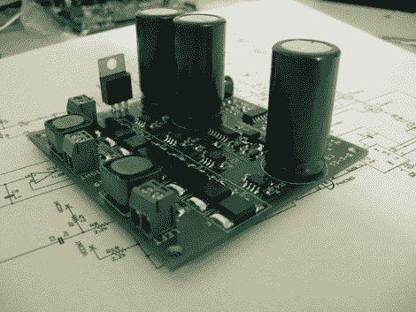

# D 类音频放大器从试验板到 PCB

> 原文：<https://hackaday.com/2011/05/21/class-d-audio-amplifier-makes-it-from-breadboard-to-pcb/>

几个月来一直在研究 D 类音频放大器。你在上面看到的是最新版本的放大器。D 类放大器使用晶体管开关(或本例中的 MOSFET 开关)来产生驱动扬声器的脉宽调制信号。这与普通放大器不同，因为它不会产生传统放大器产生的热量，因此效率更高。

休息之后你可以听到演示。它采用单电源笔记本电脑模块供电，我们确实听到系统发出一点嗡嗡声。尽管如此，我们还是对小主板能够输出的功率和质量非常满意。看看 11 月的一篇帖子，了解一下开发的内容。如果你仍然渴望更多的细节，[Ben's]在 [github 库](https://github.com/NBitWonder/class-d-amp)中分享了他的大部分原型材料。

 <https://www.youtube.com/embed/ppfeYf2zTM4?version=3&rel=1&showsearch=0&showinfo=1&iv_load_policy=1&fs=1&hl=en-US&autohide=2&wmode=transparent>

 </body> </html>