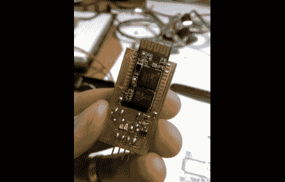

# 让 3D 打印机无线工作

> 原文：<https://hackaday.com/2011/05/21/making-a-3d-printer-work-wirelessly/>

为了寻找更多的方法来增强他的 3D 打印机，[JJ] [决定让它无线化](http://jjshortcut.wordpress.com/2011/02/19/wireless-serial-bluetooth-module/)。他得到了一些[、价值 10 美元的蓝牙模块](http://www.mdfly.com/index.php?main_page=product_info&products_id=63)，并认为这正是与他的笔记本电脑连接的东西。

它们是以表面贴装模块的形式出现的，所以他要做的第一件事就是开发一个分线板，可以插入他的 Ultimaker 3D 打印机。这提供了一个很好的机会，因为他需要做一些电平转换，使 3.3V 模块与他的 5V 数控电子设备配合良好。第一个版本的电路板结果很好，但他的通信范围真的很差。第二个版本，如上图所示，将模块的天线悬挂在分线板的边缘，效果更好。

我们在休息后嵌入了一个剪辑，它贯穿了该板的发展过程。[JJ]作为 megaupload 链接分享了 Eagle CAD 文件，但为了您的方便，我们也在休息后镜像了该文件。

[https://www.youtube.com/embed/oXpfKqx7Uhc?version=3&rel=1&showsearch=0&showinfo=1&iv_load_policy=1&fs=1&hl=en-US&autohide=2&wmode=transparent](https://www.youtube.com/embed/oXpfKqx7Uhc?version=3&rel=1&showsearch=0&showinfo=1&iv_load_policy=1&fs=1&hl=en-US&autohide=2&wmode=transparent)

[ [下载 zip 存档文件](http://hosted.hackaday.com/Bluetooth%20break-out%20board.zip)

[谢谢凯尔]