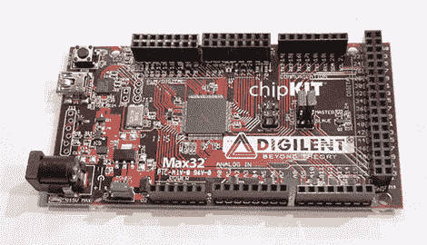
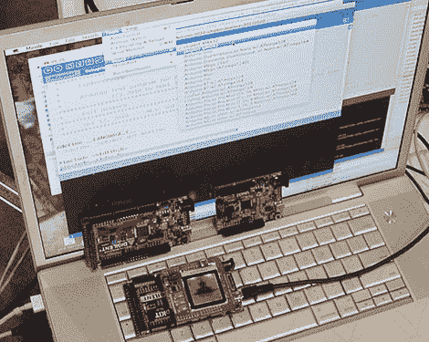

# BAMF2011: ChipKIT 是 Arduino 的 32 次方

> 原文：<https://hackaday.com/2011/05/21/bamf2011-chipkit-is-arduino-to-the-power-of-32/>

如果您渴望微控制器项目获得更多功能，但又不愿意放弃对 Arduino shields 或与之配套的库和社区知识的投资，Digilent 可以满足您的需求。他们的新 [chipKIT 板](http://www.digilentinc.com/Products/Catalog.cfm?NavPath=2,892&Cat=18)是围绕 Microchip PIC32 MCU 构建的……这是一种强大的 32 位芯片，直到最近还被排除在跨平台场景之外。大部分代码和相当数量的 Arduino shields 将与 chipKIT 一起“开箱即用”,并且熟悉的开发工具可用于所有三种主要操作系统:Windows、Mac 和 Linux。

我们[在几周前](http://hackaday.com/2011/05/12/chipkit-max32-an-arduino-mega-upgrade-with-a-pic32-under-the-hood/)第一次提到这些，但当时软件还不可用。看到开发工具的运行是相当出乎意料的…

chipKIT 真正吸引人的是它的工作流程与 Arduino 非常相似。串行引导程序与 [avrdude](http://hackaday.com/2010/10/25/avr-programming-02-the-hardware/) 一起工作，你可以使用完全相同的 IDE 编写“真正的”Arduinos 和 Digilent 的 32 位 work-like；没有必要为两种不同的主板运行两种不同的 ide，就像 Leaf Labs 的 32 位 [Maple](http://hackaday.com/2010/05/24/maple-r3-now-shipping/) 一样。作为演示，他们为一个带有 SparkFun LCD shield 的 Arduino Mega 编译并运行代码…然后将 shield 取下并放置在 Max32 上，在同一 IDE 中选择 32 位板，并重复该过程。确切的代码运行在新的板/盾组合上，具有惊人的性能——所有标准的 Arduino 库都已针对 PIC32 原生实现；这不是模仿。

因为 Digilent 不仅仅是使 Arduino IDE 适应他们的特定主板，而是开发了一个系统，通过该系统，IDE 可以扩展到新的硬件，他们希望他们的工作(不是官方的 Arduino 项目)可以回滚到主线代码中，并且其他开发人员可以加入到为他们自己的主板提供 Arduino IDE 支持的行列中，无论他们是基于 AVR、PIC32 还是完全不同类型的微控制器。基础已经奠定。

该芯片套件有两个版本:Uno32 和 Max32，分别与 Arduino Uno 和 Mega 2560 的外形相似。这些可以直接从 Digilent 的网站上订购，IDE 从今天起可以免费在 T2 下载。我们有现成的评估硬件，预计将在不久的将来提供适当的评估。