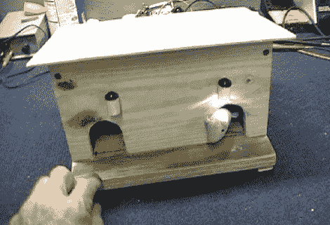

# 黑客为猫的享受

> 原文：<https://hackaday.com/2011/05/22/hacking-for-feline-enjoyment/>

[Dino]坚持他每周破解一个项目的目标。这一次，他正在研究一种能逗他的猫开心的玩具。该项目围绕一个有两个洞的老鼠屋展开，老鼠可以从洞里伸出头来。当他们这样做时，一盏小小的 LED 灯会照亮他们的外表，希望能引起你的懒猫的注意。

自动化这个设备的机制相当聪明，让我们想起了[最没用的机器](http://hackaday.com/2009/12/30/simplest-most-useless-machine/)。也就是说，当它移动以露出其中一只鼠标时，两端固定鼠标的电枢会启动盒子中间的限位开关。每只老鼠身上都绑着一根杆子，旁边还有一个叶片开关，当老鼠被猫击中头部时，叶片开关会使老鼠后退。

休息之后，[迪诺]只需要花大约六分钟的时间在视频中向我们展示整个建筑。接下来是线路的走查和一些与家庭宠物玩耍的时间。尽管有预期的目的，但看起来狗比猫更感兴趣。无论哪种方式，在我们看来都是赢家。

 <https://www.youtube.com/embed/szOejQhKgX8?version=3&rel=1&showsearch=0&showinfo=1&iv_load_policy=1&fs=1&hl=en-US&autohide=2&wmode=transparent>

 </body> </html>