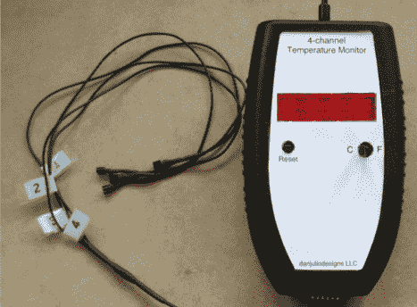

# Arduino 库的无线 4 通道温度监控器

> 原文：<https://hackaday.com/2011/05/23/wireless-4-channel-temperature-monitor-from-arduino-libraries/>

不管你对 Arduino 平台有什么看法，但确实有大量的库可供选择。这正是[丹·胡里奥]在建造他那看起来光滑的 4 通道温度监视器[时着手做的事情。监视器由一个 Arduino](http://www.danjuliodesigns.com/projects/projects/temp_monitor.html) [RBBB](http://shop.moderndevice.com/products/rbbb-kit) ，2×16 字符 LCD 和四个 [DS18B20](http://www.sparkfun.com/products/245) 单线数字温度计组成。[丹]还包括一个 bluesmirf 接口 OS X 监测程序。使用蓝牙、LCD 和温度监视器的库，Arduino 代码只有大约 200 行，非常容易理解。在[Dan]的[站点](http://www.danjuliodesigns.com/projects/projects/temp_monitor.html)查看更多信息。

如果你想要更多的温度传感器项目，看看这个[马克杯](http://hackaday.com/2011/04/12/temperature-sensing-mug-means-never-burning-your-mouth-again/)或这个[基于 PIC 的](http://hackaday.com/2011/04/10/pic-based-temperature-logger-with-onboard-storage/)监视器，或者也许你想把它放在 [Atmel](http://hackaday.com/2011/04/08/compost-heap-temperature-logger-helps-keep-things-hot/) 家族中。