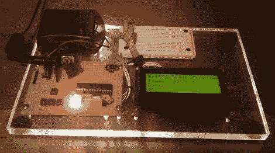

# 构建您自己的实时时钟

> 原文：<https://hackaday.com/2011/05/23/building-your-own-real-time-clock/>

像许多电子爱好者一样，[Pete]发现他有一种强烈的愿望要为自己造一个时钟。他不想把一个分立的实时时钟 IC 塞进盒子里，然后就此结束，[所以他选择围绕一个微控制器构建自己的](http://petemills.blogspot.com/2011/05/real-time-clock-part-1.html)。

在研究了几个 RTC ICs 的规格后，他为自己的时钟定义了一些精度要求，并开始建造。他开始使用 32，768 Hz 的手表晶体，但发现仅使用 24 小时后，精确度就下降了约 46 ppm。这远远超出了他自己设定的+/- 3 ppm 的公差目标，因此他购买了一个分辨率约为之前晶体分辨率 500 倍的振荡器。

在编写了一些代码以确保时钟保持稳定后，他计算出他的精度应该约为 0.18 ppm——完全在他可接受的容差范围内。

[Pete]说这只是他的时钟构造的第一部分，未来的版本应该包括大量的附加功能，所以请密切关注更新。