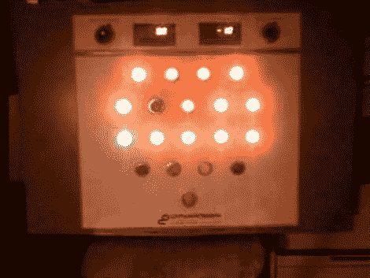

# 伟大的垃圾场发现导致回收控制面板项目

> 原文：<https://hackaday.com/2011/05/23/great-junk-yard-find-leads-to-a-reclaimed-control-panel-project/>

“你能相信有人把这个扔掉了吗？”这些年来，心态让我们陷入了一些麻烦，但是看看[约书亚]在废品场发现了什么！这是一个能量转换站的门，里面有 14 个指示灯和许多其他的小玩意儿。但由于这只是一扇门，他需要一种方法来监控控制和驱动指示器。他用来启动和运行这个系统的核心是 PIC 18F2550。由于一对 ULN2803 达林顿阵列可以切换更高的 24 伏电平，因此驱动指示器没有任何问题。

他的文章没有提到所用的方法，但这个小组在顶部也有几米。在休息后的视频中，你可以清楚地看到他让他们都工作了。我们敢打赌，每个按钮都有一个计划，因为这将是他们今年以外星人入侵为主题的万圣节展示的突出特色。

[https://www.youtube.com/embed/vs8FLGzKsfU?version=3&rel=1&showsearch=0&showinfo=1&iv_load_policy=1&fs=1&hl=en-US&autohide=2&wmode=transparent](https://www.youtube.com/embed/vs8FLGzKsfU?version=3&rel=1&showsearch=0&showinfo=1&iv_load_policy=1&fs=1&hl=en-US&autohide=2&wmode=transparent)